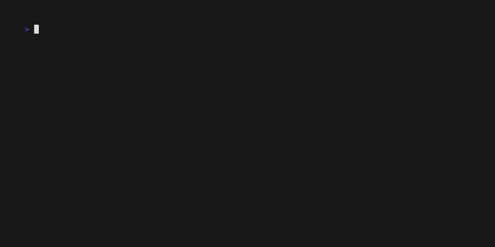

[](https://goreportcard.com/report/github.com/sgaunet/gocrypt)
[](https://github.com/sgaunet/gocrypt/releases/latest)

[](https://codeclimate.com/github/sgaunet/gocrypt/maintainability)
[](https://godoc.org/github.com/sgaunet/gocrypt)
[]

# Gocrypt

gocrypt is a command line tool to encrypt/decrypt file in AES128/256/512.

Usage is quite simple :

```
$ gocrypt help
Tool to encrypt/decrypt file in AES128/256/512.

Usage:
  gocrypt [command]

Available Commands:
  completion  Generate the autocompletion script for the specified shell
  dec         decrypt file in AES 128/256/512
  enc         encrypt file in AES 128/256/512
  help        Help about any command
  version     print version of gocrypt

Flags:
  -h, --help   help for gocrypt

Use "gocrypt [command] --help" for more information about a command.
```

Here is a little demo:



# Install

Download the binary in the release section. There is no docker image, but you can install a binary in your Docker image if needed. If you want to create a docker image from scratch, you will need to do a multi stage docker build in order to download the binary.

## With homebrew

```
brew install sgaunet/tools/gocrypt
```

## Use it in your own Docker image

```
FROM sgaunet/gocrypt:latest as gocrypt

FROM alpine:latest
COPY --from=gocrypt /gocrypt /usr/local/bin/gocrypt
...
```

# Tests

Tests are done with [venom](https://github.com/ovh/venom).

```
cd tests
venom run
```

# Development

This project is using :

* golang
* [task for development](https://taskfile.dev/#/)
* docker
* [docker buildx](https://github.com/docker/buildx)
* docker manifest
* [goreleaser](https://goreleaser.com/)
* [venom](https://github.com/ovh/venom) : Tests
* [pre-commit](https://pre-commit.com/)

There are hooks executed in the precommit stage. Once the project cloned on your disk, please install pre-commit:

```
brew install pre-commit
```

Install tools:

```
task dev:install-prereq
```

And install the hooks:

```
task dev:install-pre-commit
```

If you like to launch manually the pre-commmit hook:

```
task dev:pre-commit
```

